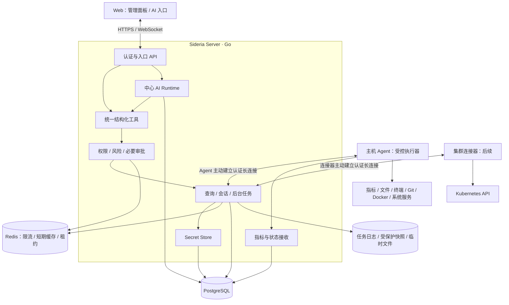

# 巡星 · Sideria 整体架构

更新日期：2026-10-06  
状态：初始设计，尚未实现和验证  
本地仓库：`C:\Document\Desktop\Sideria`  
远端仓库：[shawns-yao/Sideria](https://github.com/shawns-yao/Sideria)

## 1. 产品定位

Sideria 是面向个人多服务器场景的智能运维工作台。传统面板与 AI 入口共存，共用结构化工具、权限检查、执行结果与审计。

AI 是核心功能，从 MVP 起提供实际状态分析、证据调查和建议。用户可以询问服务器异常、容器日志、项目 Git 状态和部署候选；首版 AI 使用 Observe/Suggest，不自主修改服务器。用户通过确定性面板发起的写操作仍按权限与任务机制执行。

初期面向单用户、单中心和 Linux 主机。每台机器安装主机 Agent，长期支持普通主机、独立 Docker 主机及 Kubernetes 节点；已有集群接入后续通过独立连接器完成。

## 2. 总体结构

图中表示职责与逻辑流向，不要求分别部署。中心采用模块化单体，Secret Store 初期为中心模块，引入 Redis 承担限流、短期缓存和并发协调，不预先引入微服务或额外消息队列。指标接收复用已认证的节点通道，不要求 Agent 额外开放入站端口。

## 3. 组件职责

| 组件 | 职责 | 边界 |
| --- | --- | --- |
| Web | 目标选择、状态、操作、证据与建议审查 | 只访问中心，不直接连接 Agent、数据库或模型提供方 |
| 中心服务 | 认证、工具、调度、状态存储、转发和审计 | 统一检查所有入口，不把 AI 请求当作更高权限 |
| AI Runtime | 理解目标、主动调用读取工具、解释与建议 | 主机不运行 LLM；MVP 不调用修改工具或任意 Shell |
| 主机 Agent | 指标、文件、终端、Git、Docker 和已授权主机操作 | 校验实际目标、能力、权限与请求；不理解自然语言 |
| 集群连接器 | Kubernetes 资源查询与后续受控操作 | 独立身份与 RBAC，不默认使用 cluster-admin |
| PostgreSQL | 中心结构化数据与持久任务事实 | 仅中心访问；日志与大文件独立存放 |
| Redis | 限流、短期缓存、并发租约 | 不替代持久任务、审批和 Agent 去重记录 |

## 4. 资源与操作对象

- Host 具有稳定身份和多个地址；IP、主机名不是身份主键。
- Docker 是主机能力；Container 属于具体 Host 与 Runtime。
- 项目工作目录属于某台 Host。同一远端仓库的不同 checkout 分别登记，分支与 HEAD 按实际查询展示。
- Cluster 独立于 Host；Node 通过明确证据与 Host 关联。
- 文件、终端和 Git 操作选择服务器与具体路径；Compose 选择服务器与项目；Kubernetes 操作选择集群、命名空间和资源。
- 初期只有默认 Workspace，不提前实现跨 Workspace 共享。

具体标识和关联见[资源模型](design/resources.md)，本文不定义数据库 schema 或正式 API。

## 5. 共用工具与执行路径

UI/AI → 参数与目标校验 → 权限与风险检查 → 必要审批 → 查询、会话或后台任务 → Agent/连接器 → 结构化结果与审计。

普通查询不强制创建完整 Task；指标持续上报；终端按会话管理；需要持久进度和恢复的操作采用 Task → Step → 目标执行 → Attempt。生命周期详见[通信](design/communication.md)和[任务](design/tasks.md)。

AI 分析单独关联证据、时间、建议版本和后续任务。建议不等于执行；状态变化后需复核。模型不可用时保留实际数据与操作能力，但不能因此声称 AI 验收完成。

幂等、限流和有界并发从 MVP 实现，Redis 锁不等于外部操作只执行一次，详见[可靠性设计](design/reliability.md)。

秘密以受保护引用流转，权限与审批规则由[安全设计](design/security.md)和[数据设计](design/storage.md)统一维护。

## 6. 功能文档入口

| 功能 | 详细设计 |
| --- | --- |
| AI 主动调查、解释与建议 | [AI](features/ai.md) |
| 注册、身份、能力、Agent 更新 | [服务器接入](features/agent.md) |
| CPU、内存、磁盘与上下行 | [监控](features/monitoring.md) |
| 目录浏览与文件传输 | [文件](features/files.md) |
| 网页终端与 SSH 边界 | [终端](features/terminal.md) |
| 服务器项目、分支和 Git 操作 | [Git](features/git.md) |
| 容器与 Compose | [Docker](features/docker.md) |
| 代理范围与网络诊断 | [代理](features/proxy.md) |
| 系统服务与软件安装 | [安装](features/installation.md) |
| Diff、快照与回滚 | [配置变更](features/configuration.md) |
| 集群查询与后续操作 | [Kubernetes](features/kubernetes.md) |
| 异常触发与恢复通知 | [告警](features/alerts.md) |

## 7. 部署与阶段

中心与 Agent 使用 Go，前端使用 Vue 3 + TypeScript，静态产物嵌入中心。PostgreSQL 与 Redis 作为中心依赖部署，受管服务器无需安装它们或 LLM。主机 Agent 建议使用 systemd，避免依赖被管理的容器运行时。部署与资源预算见[部署设计](design/deployment.md)。

MVP 必须同时覆盖多主机日常操作和 AI Observe/Suggest，以及服务器项目的 Git 状态查询。Git 写操作、AI Execute、专项代理诊断、完整部署与集群能力后续逐项开放；阶段及验收仅在[实施文档](roadmap.md)维护。

## 8. 页面与目标上下文

单服务器首页采用“深夜天文台 + 精密仪器”的不对称仪表台：CPU 与 Memory 占上方主要区域，Disk、Network 与紧凑 System Summary 位于下方。四大指标始终为首屏主角；颜色表达状态，不以四种固定颜色区分指标。开放弧线、用量尺度、轨道和真实曲线分别匹配指标语义，详细规则集中维护在[前端界面设计](design/ui.md)。

工作台保留右侧可收起的 AI 和底部可展开的多标签终端。状态光区分 Agent 连接、任务执行和健康结论；温度、分类占用、趋势与告警均以实际数据和已实现能力为依据。

技术职责、组件和首个代码切片见[前端架构](design/frontend.md)，各功能概念图取舍见[页面设计](design/pages.md)。AI 已确认优先接入 OpenAI 兼容 Responses API，提供方与模型单独配置。

- 服务器总览：状态、上下行、异常与标签。
- 服务器详情：监控、文件、终端、项目与 Git、Docker，以及按阶段开放的代理、服务和安装。
- 智能运维入口：目标范围、证据、建议和关联任务；在服务器、容器和项目页面提供上下文入口。
- 任务中心：进度、日志、尝试历史和实际结果。
- 后续集群与告警页面：已实现的资源查询、异常与恢复。
- 设置：身份接入、凭据、模型、采样、保留和 Agent 版本。

所有操作持续显示目标服务器、项目或集群。切换页面不能把未完成操作隐式转移到新目标。传统面板和 AI 共享结果与时间线，未实现能力不显示为可执行流程。

## 9. 文档分工与未定项

整体架构维护产品定位、组件和全局边界；features 维护单个功能；design 维护跨功能机制；roadmap 维护交付与验收。新增规则放到所属文档，通过链接引用，不向本文堆积完整细节。

采样和保留参数、长连接选型、协议字段、schema、模型提供方、发行版支持与资源占用仍待实施确认。所有“建议”“候选”和验收标准均不是已完成能力。

返回[文档索引](README.md)；外部资料见[技术依据](references.md)。
