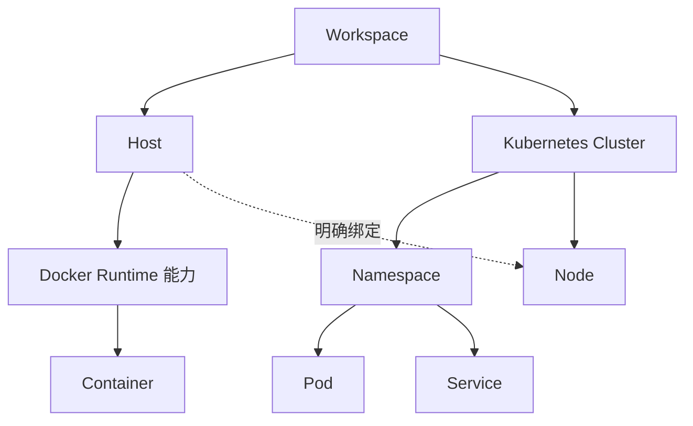

# 资源模型

更新日期：2026-10-06  
状态：设计阶段，尚未实现和验证

Workspace 是逻辑资源与授权范围，初期只需一个默认范围，不因此实现多租户。主要资源关系如下：

- Host 使用稳定身份，IP 和主机名是属性；Docker Host 表示具备 Docker 能力的 Host，不另建一套机器身份。
- Runtime 表示主机运行时能力，Container 归属相应运行时；容器身份同时包含所属主机和运行时范围。
- Cluster 独立于 Host；Namespace、Pod、Service 等资源归属集群，并按资源类型记录命名空间及资源身份。
- Kubernetes Node 与 Host 通过集群 ID、Node UID 和明确证据关联；Host 与 Cluster 不是父子关系。
- 同一 Host 是否可出现在多个 Workspace 尚待确认；若允许，需先定义共享授权、凭据归属和撤销规则，不复制主机身份来模拟共享。

Workspace 共享规则、Runtime 与集群资源的标识方式，需要在相应数据库结构和 API 实施前明确；这里只定义概念关系。

## 服务器项目与 Git 工作目录

Host 下登记 ProjectWorkingCopy，身份由稳定项目 ID 与所属主机范围确定。路径、Git 根目录、远端、分支和 HEAD 分别记录或查询；同一个远端在不同机器或 worktree 中不是同一工作目录。

项目可以关联 Compose 项目或部署记录，但当前 Git HEAD 不自动等同于运行版本。具体发现、查询及写操作边界见[Git 管理](../features/git.md)。

## 关联文档

- [整体架构](../architecture.md)
- [服务器接入](../features/agent.md)
- [Kubernetes](../features/kubernetes.md)
- [权限与审批](security.md)
